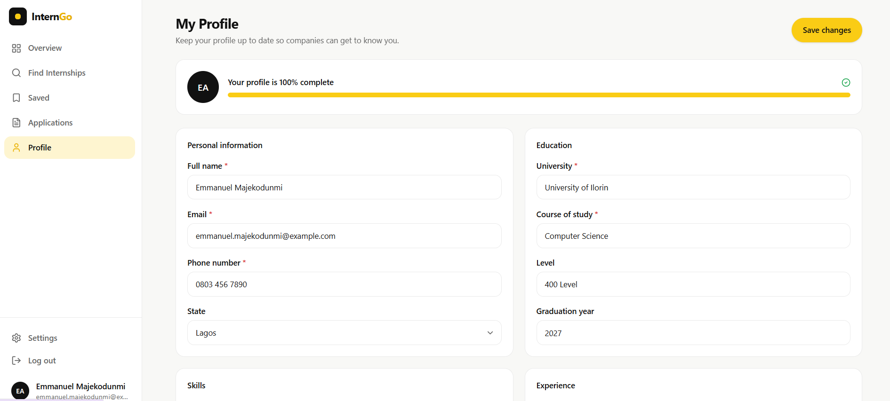

# InternGo

> **Find the right internship. Start your career.**

InternGo is a modern internship discovery and application platform designed to connect students and early-career professionals with internship opportunities across Nigeria.

The platform provides a focused experience for discovering opportunities, managing applications, saving internships, maintaining a professional profile, and helping companies manage internship recruitment.

---

## ✨ Overview

Finding relevant internship opportunities can be difficult when opportunities are scattered across different platforms.

**InternGo brings the process into one place.**

Students can discover internships based on their interests and location, view opportunity details, save positions, apply, and track their application progress.

Companies can publish internship opportunities, review applicants, shortlist candidates, and manage their recruitment activity from a dedicated dashboard.

---

## 🚀 Features

### For Students

- 🔎 Search and discover internship opportunities
- 📍 Filter opportunities by location
- 💼 Browse internships by role and category
- 🔖 Save internships for later
- 📝 Apply to internship opportunities
- 📊 Track application status
- 👤 Create and manage a professional profile
- 🎓 Add education and academic information
- 🛠️ Showcase technical and professional skills
- 📋 View application history

### For Companies

- 🏢 Create and manage company profiles
- 📢 Publish internship opportunities
- 👥 View internship applicants
- 🔍 Search and filter candidates
- ⭐ Shortlist promising applicants
- ❌ Reject applications
- 📊 Monitor hiring activity
- 📈 View recruitment statistics
- 👤 Review candidate profiles

---

## 📸 Screenshots

### Landing Page

The InternGo landing page introduces the platform and allows users to quickly search for internship opportunities.


---

### Internship Overview

Students can browse available opportunities and explore internship details, locations, duration, and other relevant information.


---

### Application Tracking

Students can monitor their applications and see whether an application is pending, under review, shortlisted, accepted, or rejected.


---

### Company Dashboard

Companies get a dedicated workspace for managing internship opportunities and monitoring their recruitment activity.


---

### Student Profile

Students can maintain a complete professional profile containing their personal information, education, skills, and experience.



---

## 🧩 User Experience

InternGo is designed around a simple principle:

> **Make finding and managing internships feel simple.**

The interface focuses on:

- Clear information hierarchy
- Minimal visual clutter
- Fast navigation
- Consistent components
- Responsive layouts
- Clear application statuses
- Simple interactions
- Accessible visual contrast

The design system uses a clean monochrome foundation with **InternGo yellow** as the primary accent.

---

## 🛠️ Tech Stack

| Technology | Purpose |
|------------|---------|
| **Next.js 16** | React framework and application routing |
| **React** | User interface |
| **TypeScript** | Type-safe development |
| **Tailwind CSS v4** | Styling and responsive layouts |
| **Lucide React** | Interface icons |
| **LocalStorage** | Client-side persistence |
| **ESLint** | Code quality and linting |

---

## 🏗️ Project Structure

```text
interngo/
│
├── public/
│   └── Static assets
│
├── screenshots/
│   ├── Landing Page.png
│   ├── Intern Overview.png
│   ├── Intern Application.png
│   ├── Company Overview.png
│   └── Profile.png
│
├── src/
│   │
│   ├── app/
│   │   ├── about/
│   │   ├── companies/
│   │   ├── company/
│   │   │   ├── applicants/
│   │   │   ├── dashboard/
│   │   │   ├── internships/
│   │   │   └── profile/
│   │   ├── dashboard/
│   │   ├── internships/
│   │   └── ...
│   │
│   ├── components/
│   │   ├── company/
│   │   ├── dashboard/
│   │   ├── internships/
│   │   ├── marketing/
│   │   ├── shared/
│   │   └── ui/
│   │
│   ├── data/
│   │   ├── applicants.ts
│   │   ├── companies.ts
│   │   ├── defaults.ts
│   │   └── internships.ts
│   │
│   ├── hooks/
│   │   ├── useAppData.ts
│   │   └── useLocalStorage.ts
│   │
│   ├── lib/
│   │   └── utils.ts
│   │
│   └── types/
│       └── index.ts
│
├── package.json
├── next.config.ts
├── tsconfig.json
└── README.md